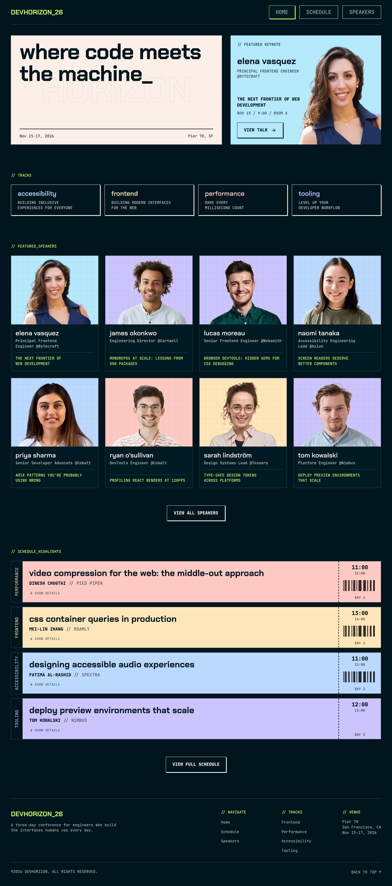

# Frontend Mentor - Tech Conference Site solution

This is a solution to the [Tech Conference Site challenge on Frontend Mentor](https://www.frontendmentor.io/challenges/tech-conference-site). Frontend Mentor challenges help you improve your coding skills by building realistic projects.

## Table of contents

- [Overview](#overview)
  - [The challenge](#the-challenge)
  - [Screenshot](#screenshot)
  - [Links](#links)
- [My process](#my-process)
  - [Built with](#built-with)
- [Author](#author)

## Overview

### The challenge

Users should be able to:

#### Home Page

- See the conference brand, tagline, dates, and venue in the hero section
- View the featured keynote, including the speaker, talk title, and session time
- Browse the conference tracks with their names and descriptions
- See a grid of featured speakers, each card linking through to the speakers page
- Browse the schedule highlights with key talks pulled from across the three days
- Use call-to-action links to navigate to the full schedule and speakers pages

#### Schedule

- View the full conference schedule organised by day
- Filter the schedule by day (Day 01, Day 02, or Day 03)
- Filter the schedule by track (Frontend, Performance, A11y, or Tooling), with multiple track filters active at once
- Combine day and track filters to narrow down the list
- Expand and collapse each talk to show or hide its description and location
- Save talks to a personal "My Schedule" using the bookmark button on each talk
- Filter the schedule to show only saved talks via the "My Schedule" filter
- Clear all active filters with the "Clear" button

#### Speakers

- Browse all speakers in a responsive card grid, each card showing the speaker's photo, name, role, company, and the title of their talk
- Open a modal for any speaker to read their full bio and see their session
- Save the speaker's talk to "My Schedule" directly from inside the modal
- Close the modal by clicking the close button, clicking the overlay, or pressing Escape

#### UI & Accessibility

- View the optimal layout for the interface depending on their device's screen size
- See hover and focus states for all interactive elements on the page
- Navigate the entire site using only their keyboard

### Screenshot

<!--  -->

### Links

- Solution URL: [https://github.com/jkaps9/tech-conference-site](https://github.com/jkaps9/tech-conference-site)
- Live Site URL: [https://devhorizon26.netlify.app/](https://devhorizon26.netlify.app/)

## My process

### Built with

- Semantic HTML5 markup
- CSS custom properties
- Flexbox
- Mobile-first workflow
- [Astro](https://astro.build/)
- [SASS](https://sass-lang.com)

## Author

- Frontend Mentor - [@jkaps9](https://www.frontendmentor.io/profile/jkaps9)
